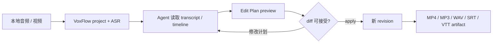

# VoxFlow 1.0

**让 Codex、Claude 或任意 Agent 安全地编辑本地音频和视频。**

VoxFlow 不是另一个把聊天框塞进剪辑器的应用。Agent 负责理解“删掉口癖、交换两段、修正这句”这样的意图；VoxFlow 通过 CLI / MCP 提供稳定 ID、编辑预览、并发 revision 校验、撤销和 FFmpeg 导出，把自然语言意图变成可检查、可重放的媒体编辑。

[](https://github.com/jhuanxx44/voxflow/actions/workflows/ci.yml)
[](https://github.com/jhuanxx44/voxflow/actions/workflows/security.yml)
[](LICENSE)

```text
你：删掉开场寒暄，把结论移到最前面，然后导出 MP4
Agent：读取 transcript/timeline → 生成 Edit Plan → preview diff
你或 Agent：确认 apply → VoxFlow 创建新 revision → FFmpeg 导出 artifact
```

## 为什么是 VoxFlow

| 能力 | 对 Agent 编辑的意义 |
|---|---|
| `clip_*` / `tok_*` 稳定 ID | Agent 引用确定对象，不靠易误删的模糊文本匹配 |
| `edit_preview` → `edit_apply` | 写入前先看到精确 diff、时长变化和 warning |
| `expected_revision` + project lock | Codex、Web 与 CLI 同时编辑时拒绝静默覆盖 |
| 幂等请求 + 原子 manifest | 重试不会重复剪辑，失败不会留下半个 revision |
| 线性 history + undo | 每次修改可追溯；撤销也创建新 revision，不改写历史 |
| 持久化 jobs / artifacts | ASR、TTS、导出可轮询、恢复和再次下载 |
| 本地媒体边界 | CLI/MCP 不向模型返回媒体 bytes；模型只处理所需结构化文本 |

同一个 project 可由 MCP、CLI 和 Web 轮流编辑，三种入口共享 application/core、timeline 和 revision。VoxFlow 不绑定模型厂商：Codex、Claude、自建模型或普通脚本都可以使用同一份工具契约。

## 一条完整工作流



## 可用能力

- 音频与视频导入；FunASR 本地识别、热词、说话人分离和内容寻址缓存。
- 删除、裁剪、分割、词级删除、重排、文本修正、speaker 重命名/合并。
- TTS replacement 候选、试听、duration policy、preview/apply 后进入正式 timeline。
- MP4、MP3、WAV、SRT、VTT 真实导出；artifact 与 revision 持久化。
- React Web 编辑器：字幕搜索、逐字/逐段编辑、拖拽、播放同步、Undo/Redo。
- stdio MCP server 与稳定 JSON CLI；长任务使用 start/status 模式，不阻塞 Agent 调用。

> 当前定位是单机、本地优先的编辑引擎。Web 默认只监听 loopback，未提供多租户认证，不应直接暴露到公网。安全边界见 [SECURITY.md](SECURITY.md)。

## 安装

要求：macOS/Linux、Python 3.11、uv、FFmpeg/ffprobe。Web 额外要求 Node.js 20+。

### 1. CLI / MCP 用户

```bash
uv tool install --python 3.11 \
  'voxflow[mcp,asr-local,tts] @ git+https://github.com/jhuanxx44/voxflow.git'
voxflow --json doctor
```

### 2. Web 用户

```bash
git clone https://github.com/jhuanxx44/voxflow.git
cd voxflow
./start.sh
```

打开 `http://127.0.0.1:3001`。`./start.sh -b` 只启动 8082 后端。

### 3. 贡献者

```bash
git clone https://github.com/jhuanxx44/voxflow.git
cd voxflow
make sync
npm ci
make check
```

三条路径的完整说明、轻量无 Torch 安装和故障诊断见 [安装指南](docs/INSTALLATION.md)。不要用手工 `pip install` 拼装环境；Python 以 `pyproject.toml` / `uv.lock` 为准，前端以 `package-lock.json` 为准。

## CLI / MCP 使用

VoxFlow 现在同时提供确定性的 Headless 编辑内核。Codex、Claude 或脚本负责理解编辑意图，VoxFlow 负责项目持久化、识别、Edit Plan 校验、revision、FFmpeg 渲染和 artifact 管理。

默认项目数据位于系统应用数据目录，可用 `VOXFLOW_HOME=/path` 覆盖。

可用 `VOXFLOW_ALLOWED_INPUT_ROOTS=/media:/another/root` 限制 CLI/MCP 可导入的本地目录；路径会先解析 realpath，因此指向根目录外的 symlink 也会被拒绝。媒体大小、时长和导出超时还可分别通过 `VOXFLOW_MAX_INPUT_BYTES`、`VOXFLOW_MAX_MEDIA_DURATION_MS`、`VOXFLOW_EXPORT_TIMEOUT_SECONDS` 配置。ASR 缓存按源文件 SHA-256、provider、模型和 hotwords 内容寻址，存放在 `VOXFLOW_HOME/asr-cache/`。

### 版本、诊断与维护

```bash
# 不创建数据目录的轻量版本查询
voxflow --json version

# Python、FFmpeg/ffprobe、codec、磁盘、Schema 与 provider 诊断
voxflow --json doctor

# 默认只预览；--apply 前会备份所有发生变化的 manifest
voxflow --json project migrate <project-id> --dry-run
voxflow --json project migrate <project-id> --apply

# 生成脱敏支持包：不含媒体、transcript、prompt、job request 或原始日志
voxflow --json diagnostics create --out /absolute/path/diagnostics.zip

# mark-and-sweep 默认只预览；source、正式 export 和任何 revision 引用均不会删除
voxflow --json maintenance cleanup --dry-run
voxflow --json maintenance cleanup --apply
```

VoxFlow 明确拒绝高于当前 v1 的持久化 Schema；缺失版本号的早期 manifest 可通过 `project migrate` 升级。清理 TTL 可用 `VOXFLOW_CANDIDATE_TTL_SECONDS`、`VOXFLOW_CACHE_TTL_SECONDS` 和 `VOXFLOW_TEMPORARY_TTL_SECONDS` 配置；`VOXFLOW_MIN_FREE_BYTES` 控制 job 启动的最小剩余空间。CLI、MCP、Web 和 worker 的结构化 JSONL 事件写入 `VOXFLOW_HOME/logs/events.jsonl`，只记录受控 ID、phase、duration、status 和错误码，不记录用户文本或路径。

### Agent 工作流

```bash
# 1. 导入媒体
voxflow --json project create /absolute/path/input.mp4 --name "访谈粗剪"

# 2. 识别并等待完成
voxflow --json transcript start <project-id> --model advanced --wait

# 3. 分页读取/搜索稳定 IDs
voxflow --json transcript search <project-id> "就是说" --context 2
voxflow --json timeline get <project-id> --limit 100

# 4. 所有写入先 preview，再 apply
voxflow --json edit preview <project-id> --plan /absolute/path/edit-plan.json
voxflow --json edit apply <project-id> --plan /absolute/path/edit-plan.json

# 5. 可选：生成持久化语音候选（不会直接修改 timeline）
voxflow --json speech replace-start <project-id> <clip-id> \
  --expected-revision <revision> --text "修正后的台词" --wait

# 将 job.result.recommended_operation 放入 Edit Plan 后，仍必须 preview/apply。
# 音频默认 natural ripple；视频默认 fit_source。
# 超出 0.8–1.25 安全拉伸范围时 apply 会拒绝，需显式改用 pad_or_trim。

# 6. 导出
voxflow --json export create <project-id> --format mp4 \
  --out /absolute/path/edited.mp4 --wait
```

Edit Plan 使用稳定 `clip_*` / `tok_*` ID、当前 `expected_revision` 和唯一 `client_request_id`。文本搜索只发现候选，不直接执行模糊删除。完整 schema 位于 `voxflow/schemas/`。

`edit-plan.json` 示例（其中 ID 必须来自当前 `timeline get` / `transcript search`，不要手写猜测）：

```json
{
  "schema_version": 1,
  "project_id": "prj_...",
  "expected_revision": 1,
  "client_request_id": "codex-edit-20260805-001",
  "reason": "删除开场并缩短第二段",
  "operations": [
    {"op": "delete_clips", "clip_ids": ["clip_..."]},
    {
      "op": "trim_clip",
      "clip_id": "clip_...",
      "source_in_ms": 1250,
      "source_out_ms": 4800
    }
  ]
}
```

同一计划必须先 `edit preview`，确认 diff 后再 `edit apply`。如果 revision 已变化，重新读取 timeline 并生成新计划；不要修改原请求后复用同一个 `client_request_id`。

### MCP 配置

stdio MCP server 命令：

```bash
voxflow mcp serve
```

Codex 配置示例：

```toml
[mcp_servers.voxflow]
command = "voxflow"
args = ["mcp", "serve"]
env = { VOXFLOW_HOME = "/absolute/path/to/voxflow-data" }
```

MCP 对长任务使用 `transcript_start` / `speech_replace_start` / `export_start` 返回 job ID，再用 `job_get` 轮询。语音任务只生成候选 artifact 和 `recommended_operation`；Agent 仍需调用 `edit_preview`、得到可接受 diff/warning 后再调用 `edit_apply`。媒体内容不会通过 MCP 返回，只提供本地 artifact 路径。

本地 TTS provider 通过 `VOXFLOW_TTS_PROVIDER` 选择；默认 `indextts` 使用 `TTS_SERVICE_URL`。候选缓存键包含 provider/version、voice reference、文本和参数，存放在 `VOXFLOW_HOME/tts-cache/`。Web 会使用受控 artifact URL 试听，刷新后从 committed timeline 恢复 replacement，不依赖浏览器 Blob。

### 开发验证

```bash
make check
python3.11 scripts/smoke_cli.py
uv run python scripts/smoke_mcp.py
# CLI 生成 candidate -> MCP preview/apply -> WAV renderer
uv run python scripts/smoke_speech.py
# macOS + 本地 ModelScope 模型缓存：真实 FunASR -> MCP edit -> export
uv run python scripts/smoke_mcp_asr.py
# 601 秒 / 1202 segments 的长素材 MCP 验证
uv run python scripts/smoke_mcp_long.py
# 30–120 分钟自然语音 ASR + 12 operations + export 压测
uv run python scripts/stress_v1_long.py --minutes 30 --model advanced
```

架构、协议和设计决策见 [CLI/MCP 实施方案](docs/CLI_MCP_IMPLEMENTATION_PLAN.md)。
V1 发布证据、失败恢复、安全与长文件数据见 [V1 发布验收报告](docs/V1_RELEASE_TEST_REPORT.md)。

## 项目结构

```
├── voxflow/
│   ├── domain/          # Edit Plan、稳定 ID 与纯 timeline 规则
│   ├── application/     # project/transcript/edit/job/export 用例
│   ├── infrastructure/  # 持久化、provider、FFmpeg
│   └── interfaces/      # CLI、MCP、versioned Web API
├── src/                 # React Web adapter
├── legacy_web/          # 有 Sunset 日期的旧 Web 兼容层
├── tests/               # unit/contract/integration/property/legacy
├── e2e/                 # Playwright desktop/mobile 回归
└── app.py               # 仓库 Web composition root
```

## 文档

- [CLI / MCP 设计与完整契约](docs/CLI_MCP_IMPLEMENTATION_PLAN.md)
- [权威架构与 legacy Web 兼容边界](docs/ARCHITECTURE.md)
- [CLI、MCP、Web 与贡献者安装](docs/INSTALLATION.md)
- [V1 发布验收报告](docs/V1_RELEASE_TEST_REPORT.md)
- [可重复 Web Playwright 回归](docs/WEB_E2E.md)
- [LLM provider 配置边界](docs/LLM_PROVIDER_GUIDE.md)
- [安全策略与漏洞报告](SECURITY.md)
- [公开仓库安全审计](docs/SECURITY_AUDIT.md)
- [React 组件说明](src/components/README.md)
- [Store 架构](STORE_ARCHITECTURE.md)
- [贡献者开发约定](CLAUDE.md)

## License

VoxFlow 源码采用 [MIT License](LICENSE)。依赖、FFmpeg、模型权重、托管服务和用户媒体仍受各自条款约束，详见 [Third-party notices](THIRD_PARTY_NOTICES.md)。
